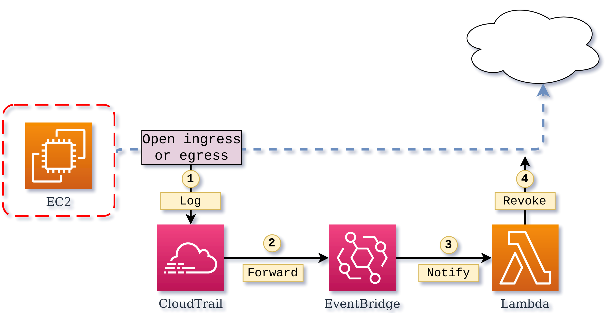

# Writing and testing AWS Lambdas in Python

Example code for 
* [Writing AWS Lambdas in Python - 10 pragmatic thoughts](https://medium.com/@jan.groth.de/writing-aws-lambdas-in-python-10-pragmatic-thoughts-97659c2716ed)
* [Testing AWS Lambdas in Python - 10 pragmatic thoughts](https://medium.com/@jan.groth.de/testing-aws-lambdas-in-python-10-pragmatic-thoughts-6a74ca8bb0c1)



## How to deploy

Assumes:
* Understanding of how to build and run AWS SAM applications
* AWS default profile configured or `AWS_PROFILE` set

Prerequisites:
* Python 3.7
* pip
* make
* aws-cli

Tested on:
* Linux
* MacOS 

### Install dependencies

```shell script
make create-artifact-bucket
```

### Create artifact bucket

Edit `ARTIFACT_BUCKET` in `Makefile` to become globally unique. E.g. `default-sg-remediation-artifacts-[your account id]` 

```shell script
make create-artifact-bucket
```

### Run tests and deploy

```shell script
make test
make deploy
```
